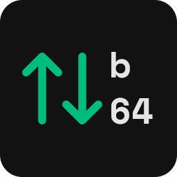
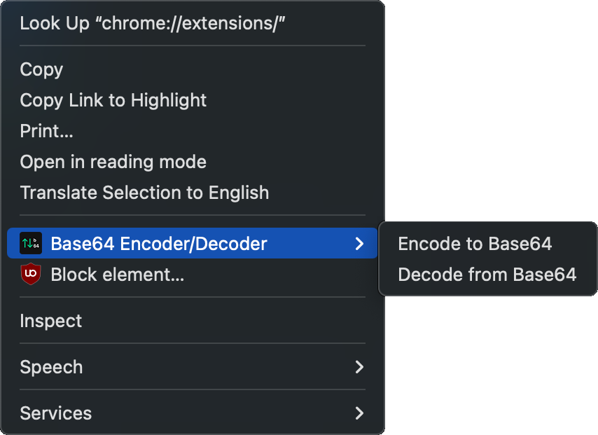

  

---

# Base64 Clipboard Encoder/Decoder Extension for Google Chrome

A simple Google Chrome extension that allows you to encode text to Base64 or decode Base64 strings directly from the context menu.  
This extension is Manifest v3 compliant.

  

## Installation

1. Download or clone this repository
2. Open Chrome and navigate to `chrome://extensions/`
3. Enable "Developer mode" in the top right corner
4. Click "Load unpacked" and select the extension directory
5. The extension is now installed and ready to use

## To-do

- [ ] Release on the Chrome Web Store
- [ ] Find $5 for the developer registration fee

## Usage

1. Select any text on a webpage
2. Right-click to open the context menu
3. Choose either "Encode to Base64" or "Decode from Base64"
4. The result will be automatically copied to your clipboard, ready to paste

## How It Works

The extension creates two context menu items that appear when you select text on a webpage. When you choose an option, the extension processes the selected text and copies the result to your clipboard using Chrome's offscreen API.

More information can be found here: [chrome-extensions-samples/functional-samples
/cookbook.offscreen-clipboard-write/](https://github.com/GoogleChrome/chrome-extensions-samples/tree/main/functional-samples/cookbook.offscreen-clipboard-write)

## Privacy

This extension:

- Does not collect or transmit any user data
- Processes all text locally within your browser
- Does not require any internet connectivity

## License

[MIT License](LICENSE)
